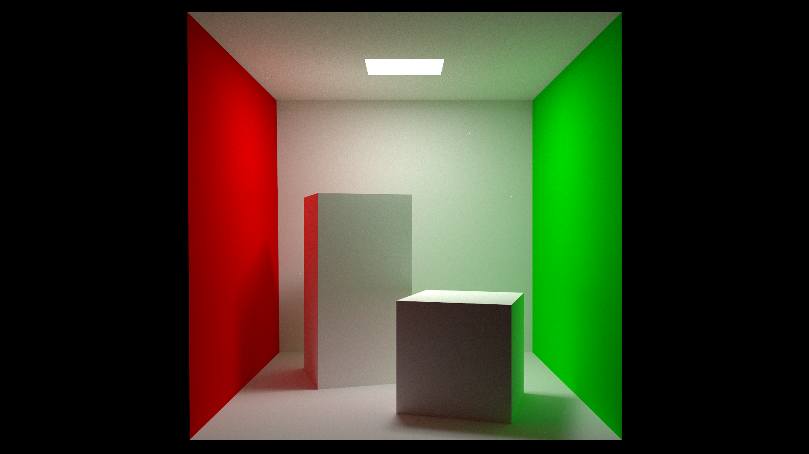
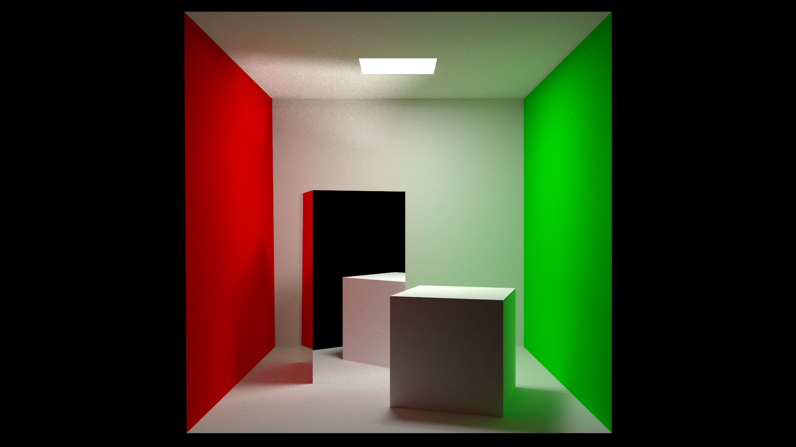
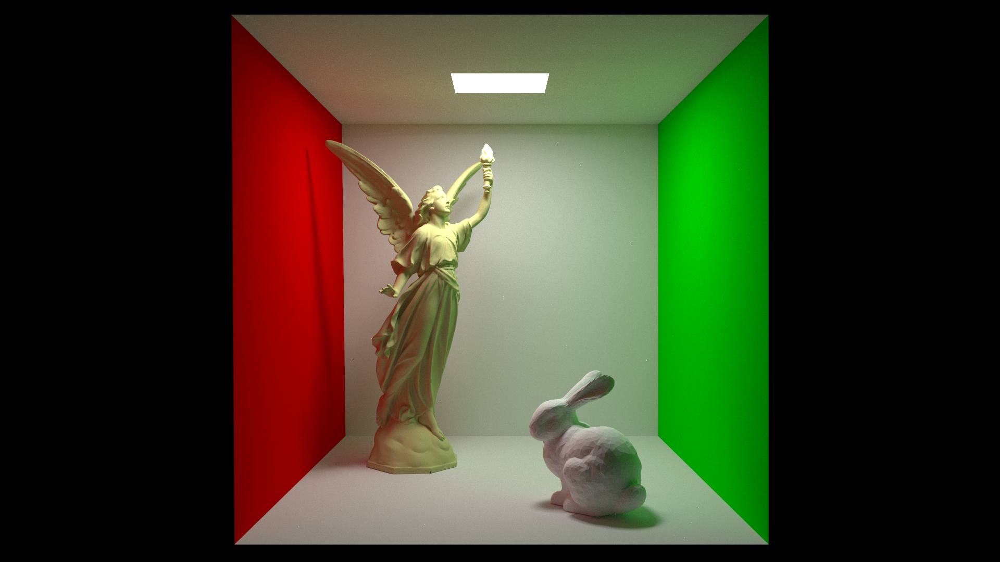
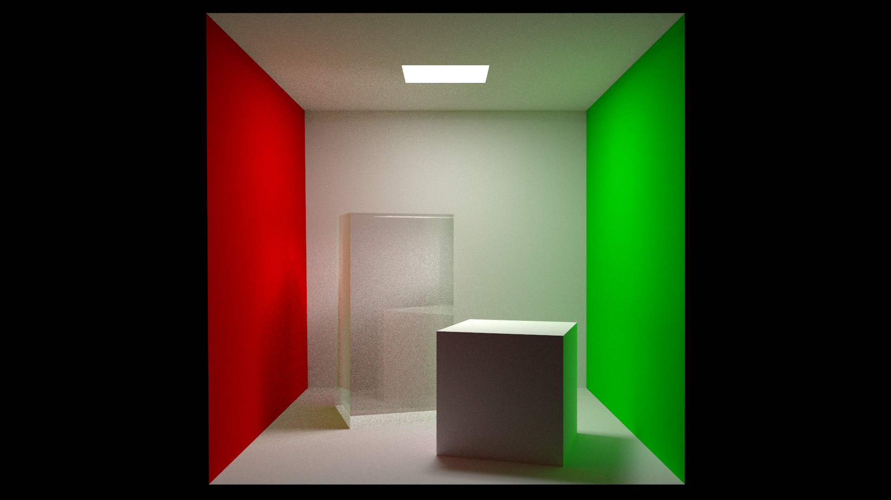
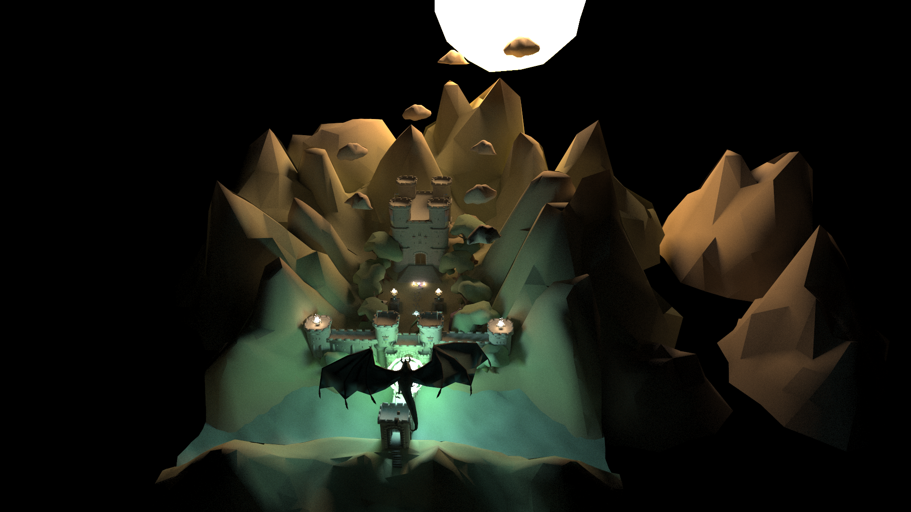
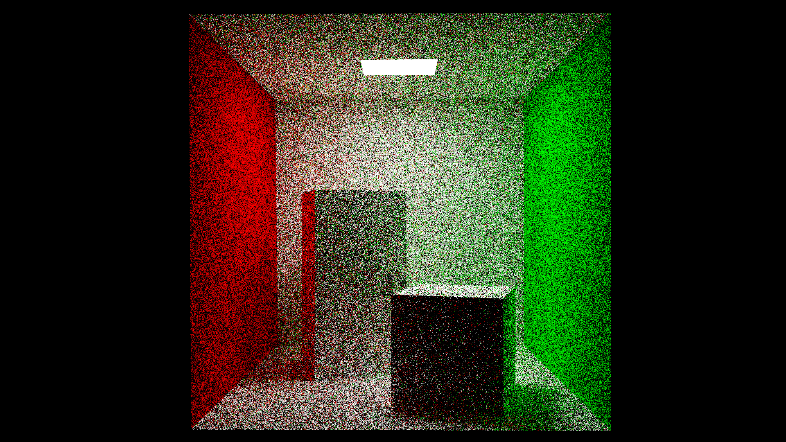
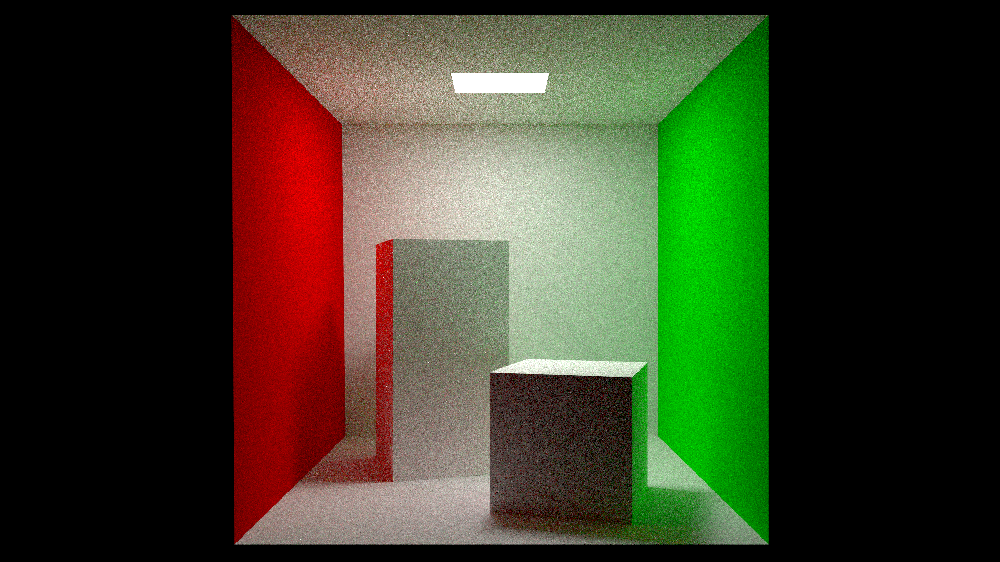

<center><h2>Advanced Computer Graphics: Final Report</h2></center>
<center>Yanpeng Wei, 2021010795</center>
<center>Yiyin Wang, 2020011604</center>


### Base

Cornell Box



Specular



Lucy & Bunny



### Transmissive

折射材质，默认真空折射率为 $1.0$, 给定 iot (Transmissive Rate), 根据 Fresnel Form 决定是否折射。

Fresnel Form 采用近似：

```glsl
float f0 = pow((eta_i - eta_o) / (eta_i + eta_o), 2);
float fresnel = f0 + (1.0f - f0) * pow(1.0 - abs(cos_theta), 5);
```

iot = 2.0:



核心代码：

```glsl
// hit_record.normal = hit_record_normal;
vec3 median = -dot(direction, hit_record_normal) * hit_record_normal;
vec3 proj_x = normalize(direction + median);
vec3 proj_y = hit_record_normal; 
// theta: 初始角度，phi: 穿过后角度
float cos_theta = dot(hit_record_normal, direction);
float sin_theta = sqrt(1-cos_theta*cos_theta);
float sin_phi, cos_phi;
float eta_i = 1.0;
float eta_o = material.iot;
float eta = 1.0 / material.iot;
if (cos_theta < 0) {
  proj_y = -proj_y;
  cos_theta = -cos_theta;
} else{
  eta = 1.0 / eta;
  eta_i = material.iot;
  eta_o = 1.0;
}
float f0 = pow((eta_i - eta_o) / (eta_i + eta_o), 2);
float fresnel = f0 + (1.0f - f0) * pow(1.0 - abs(cos_theta), 5);
if(RandomFloat() > fresnel) {
  sin_phi = eta * sin_theta;
  cos_phi = sqrt(1-sin_phi*sin_phi);
  origin = hit_record.position;
  direction = cos_phi * proj_y + sin_phi * proj_x;
} else {
  vec3 wi = direction - 2.0f * dot(direction, hit_record.normal) * hit_record.normal;
  // this is calculate shading
  origin = hit_record.position;
  direction = wi;
}
```

### 微表面模型： cook-torrance brdf

具体公式见 [链接](https://zhuanlan.zhihu.com/p/152226698)，加入了 $\alpha$ 参数作为粗糙度，$k = \frac{\alpha^2}{2}$。效果见自定义场景。

核心代码，F0 直接利用了 albedo：

```glsl
vec3 calculate_brdf(vec3 n, vec3 wi, vec3 wo, float D, vec3 h, float alpha, vec3 F0) {
  // float roughness = alpha;
  // float k = pow(roughness + 1.0f, 2) / 8.0f;
  float k = (alpha * alpha) / 2.0f;
  float G_i = dot(n, wi) / (dot(n, wi) * (1.0f - k) + k);
  float G_o = dot(n, wo) / (dot(n, wo) * (1.0f - k) + k);
  vec3 fresnel = F0 + (vec3(1.0f) - F0) * pow(1.0f - dot(h, wi), 5.0f);
  float G = G_i * G_o;
  // if(alpha == 0.0f) {
  //   return fresnel * D * dot(wi, n);
  // }
  // if(dot(n, wi) < 0.0f || dot(n, wo) < 0.0f) return 0.1f;
  return (fresnel * G * D / (4.0f * dot(n, wi) * dot(n, wo)))* dot(wi, n);
}
```

### Texture

实现了发光贴图和颜色贴图。

同时，我们将一个同时有两种贴图的同一物体做在了一个场景，用于展示：



（整个场景只有一个 object，见 ```new copy.xml```）

核心代码：

```glsl
if (material.material_type != MATERIAL_TYPE_EMISSION) {
  vec3 emission = material.emission * 
  vec3(texture(texture_samplers[material.emission_texture_id],hit_record.tex_coord));
  if(emission != vec3(0.0f)) {
    radiance += throughput * emission * material.emission_strength;
    break;
  }
}
```

### Multiple Importance Sampling

我们对于粗糙平面，我们利用 cosine-weighted sampling，对于微表面模型，我们使用 GGX sampling。

directly sampling the light:

```glsl
int n_lights = int(light_sources[0]);
if(n_lights != 0 && (material.material_type == MATERIAL_TYPE_LAMBERTIAN || material.material_type == MATERIAL_TYPE_PRINCIPLED)) {
  int r = RandomInt(n_lights) + 1;
  int face_cnt = light_sources[2 * r + 1];
  int obj = light_sources[2 * r];
  int faceid = RandomInt(face_cnt);
  // vec3 v1, v2, v3;
  ObjectInfo obj_info = object_infos[obj];
  Vertex nd0 = GetVertex(obj_info.vertex_offset + indices[obj_info.index_offset + faceid * 3 + 0]),
         nd1 = GetVertex(obj_info.vertex_offset + indices[obj_info.index_offset + faceid * 3 + 1]),
         nd2 = GetVertex(obj_info.vertex_offset + indices[obj_info.index_offset + faceid * 3 + 2]);
  vec3 d = vec3(RandomFloat(), RandomFloat(), RandomFloat());
  while(d.x + d.y + d.z == 0.0f) {
    vec3 d = vec3(RandomFloat(), RandomFloat(), RandomFloat());
  }
  d /= d.x + d.y + d.z;
  d /= d.x + d.y + d.z;
  vec3 pt = d.x * nd0.position + d.y * nd1.position + d.z * nd2.position;
  vec3 N = cross(nd1.position - nd0.position, nd2.position - nd0.position);
  float S = length(N) / 2.0f;
  N = normalize(N);
  vec3 Origin = hit_record.position;
  vec3 wi = normalize(pt - hit_record.position);
  if(dot(wi, N) > 0.0f) {
    N = -N;
  }
  TraceRay_0(Origin, wi);
  if(ray_payload.t < 0.0f) {

  } else {
    Material light_m = materials[hit_record_0.hit_entity_id];
    if(hit_record_0.hit_entity_id == obj && light_m.material_type == MATERIAL_TYPE_EMISSION) {
      vec3 radiance_dir = light_m.emission * light_m.emission_strength
                  * max(0.0f, dot(hit_record.normal, wi)) // cosine
                  * dot(N, -wi) // cosine
                  * S / pow(length(hit_record_0.position - Origin),2)
                  * n_lights * face_cnt;
      vec3 L_direct = throughput * (material.albedo_color / PI) * vec3(texture(texture_samplers[material.albedo_texture_id],hit_record.tex_coord)) * radiance_dir;
      if(material.material_type == MATERIAL_TYPE_PRINCIPLED) {
        if(dot(hit_record.normal, wi) > 0) {
          float DD = D_alpha(wi, hit_record.normal, normalize(wi - direction), material.alpha);
          vec3 wo = -direction;
          vec3 h = normalize(wi + wo);
          if(material.alpha == 0.0f) h = hit_record.normal;
          L_direct = throughput * vec3(texture(texture_samplers[material.albedo_texture_id],hit_record.tex_coord)) * radiance_dir * 
          calculate_brdf(hit_record.normal, wi, wo, DD, h, material.alpha, material.albedo_color) / dot(hit_record.normal, wi);
        } else
          L_direct = vec3(0.0f);
      }
      float sampling_the_light_pdf = dot(N, -wi) // cosine
                  * S / pow(length(hit_record_0.position - Origin),2)
                  * n_lights * face_cnt;
      if(sampling_the_light_pdf != 0.0f) {
        sampling_the_light_pdf = 1.0f / sampling_the_light_pdf;
      }
      // if(sampling_the_light_pdf != 0.0f)
      if(material.material_type == MATERIAL_TYPE_LAMBERTIAN)
        radiance += L_direct * get_pdf_ratio(Origin, wi, hit_record.normal, -direction, 0);
      else 
        radiance += L_direct * get_pdf_ratio_principled(Origin, wi, hit_record.normal, -direction, material.alpha, 0);
    }
  }
}
```

对于 MIS，我们会统计 directly sampling 和当前sample 方式的 pdf ratio $w_1, w_2$，最终会按 $w_i^2/(w_1^2+w_2^2)$ 分配光源的贡献。

50ssp, without MIS:



50ssp, with MIS:



可以看到，收敛更快（我们同时可以从Specular里看出，因为镜面反光没有 Importance Sampling）

### 景深 & 抗锯齿

景深可以修改 aperture。

效果见自定义场景。

核心代码：

```glsl
for (int i = 0; i < guo.num_samples; i++) {
  InitRandomSeed(uint(pixelCenter.x), uint(pixelCenter.y),
                 guo.accumulated_sample + i);

  // vec4 origin = camera_to_world * vec4(0, 0, 0, 1);
  // vec4 target = screen_to_camera * vec4(d.x, d.y, 1, 1);
  // vec4 direction = camera_to_world * vec4(normalize(target.xyz), 0);
  vec2 pixelPoint = vec2(gl_LaunchIDEXT.x + RandomFloat(), gl_LaunchIDEXT.y + RandomFloat()); 
  vec2 inUV = pixelPoint / vec2(gl_LaunchSizeEXT.x, gl_LaunchSizeEXT.y);
  vec2 d = inUV * 2.0 - 1.0;
  vec3 o_ = vec3(RandomInCircle() * guo.aperture, 0); // origin
  vec3 t_ = vec3(screen_to_camera * vec4(d.x, d.y, 1, 1)); // target
  vec3 f_ = normalize(t_) * guo.focal_length; // focal
  vec3 d_ = normalize(f_ - o_); // direct
  vec4 origin = camera_to_world * vec4(o_, 1);
  vec4 direction = camera_to_world * vec4(d_, 0);
  imageStore(accumulation_color, ivec2(gl_LaunchIDEXT.xy),
             imageLoad(accumulation_color, ivec2(gl_LaunchIDEXT.xy)) +
                 vec4(SampleRay(origin.xyz, direction.xyz), 1.0));
  imageStore(accumulation_number, ivec2(gl_LaunchIDEXT.xy),
             imageLoad(accumulation_number, ivec2(gl_LaunchIDEXT.xy)) + 1.0);
}
```

### 自定义场景

```
arch: F0 = "1.00 0.71 0.29", alpha = 0.1
knight: F0 = "0.05 0.05 0.05", alpha = 0.05
Bunny: F0 = "0.56 0.57 0.58", alpha = 0.2
ground: alpha = 0.01
```


加入景深：

```xml
<aperture value="0.2"/>
<focal_length value="44"/>
```


